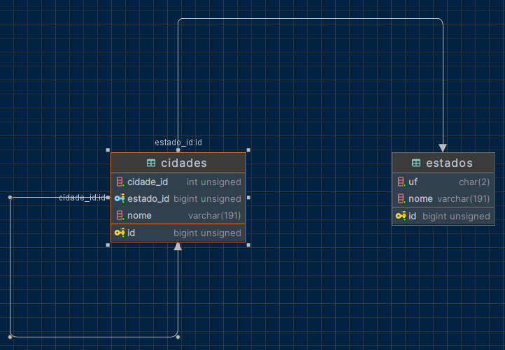

# Laravel - Migrations e Seeds dos Estados e Cidade do Brasil
[](https://github.com/andersonpereiradossantos/laravel-migration-seed-estados-cidade-brasil/blob/main/LICENSE) 
## Sobre o código
Arquivos de migração e inserção (migrations e seeds) Laravel de todos os estados e cidades do Brasil atualizados (02/09/2021) com dados extraídos do [IBGE](https://www.ibge.gov.br/geociencias/organizacao-do-territorio/estrutura-territorial/23701-divisao-territorial-brasileira.html?=&t=downloads). Contém também as Models de Estado e Cidade com todos os campos mapeados e já relacionados através do Eloquent.

Na seguinte estrutura:


##### Estados
- Código UF (id)
- UF (uf)
- Nome (nome)

##### Cidades
- Id (id autoincrement)
- Código UF (estado_id, foreign key estado) 
- Código Municipal (cidade_id)
- Nome (nome)

## Como executar o projeto
Pré-requisitos: Laravel 10.x ou superior

```bash
# Clonar repositório
git clone https://github.com/SHJordan/laravel-migration-seed-estados-cidade-brasil.git

# Adicionar arquivos nas respectivas pastas
cp -r laravel-migration-seed-estados-cidade-brasil/database/migrations/* database/migrations/
cp -r laravel-migration-seed-estados-cidade-brasil/database/seeders/* database/seeders/
cp -r laravel-migration-seed-estados-cidade-brasil/app/Models/* app/Models/

# Executar o comando de migração (Com bastante cautela para não perder os dados existentes no seu banco de dados)
php artisan migrate --seed
```

## Exemplos de utilização com o Eloquent
```php
// Obter todos os estados com suas respectivas cidades.
$estado = Estado::with('Cidades')->get();

// Obter todos as cidades da Bahia (codigo_uf = 29)
$cidades_bahia = Estado::with('Cidades')->where('estado_id', 29)->get();
```
## Licença
Este projeto é compartilhado sob a licença do MIT. Isso significa que você pode modificá-lo e usá-lo como quiser, mesmo para uso comercial. Se você gostou, considere marcar uma ⭐️.

## Autor
Jordan Humberto de Souza

[Linkedin](https://www.linkedin.com/in/shjordanx)

[Github](https://github.com/SHJordan)


## Autor Original
Anderson Pereira dos Santos

[Linkedin](https://www.linkedin.com/in/andersonpereirasantos)

[Github](https://github.com/andersonpereiradossantos)
